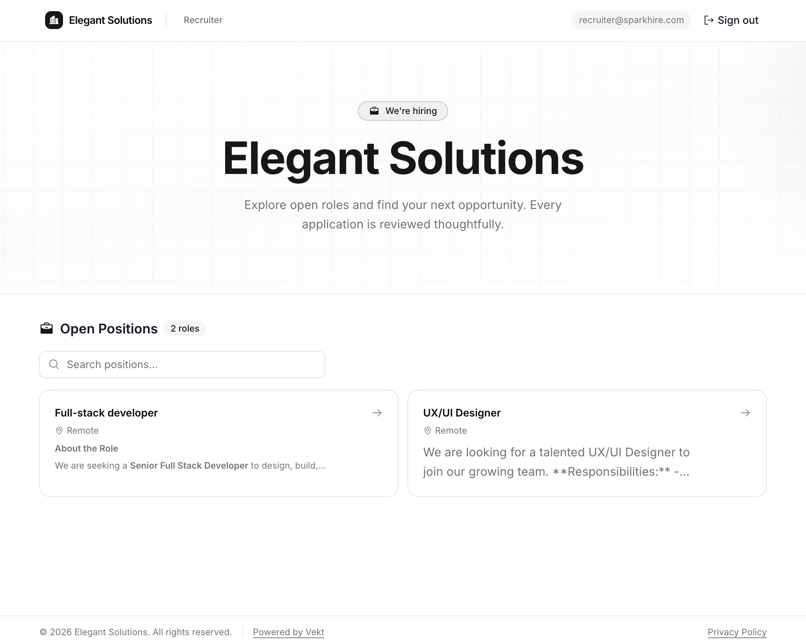
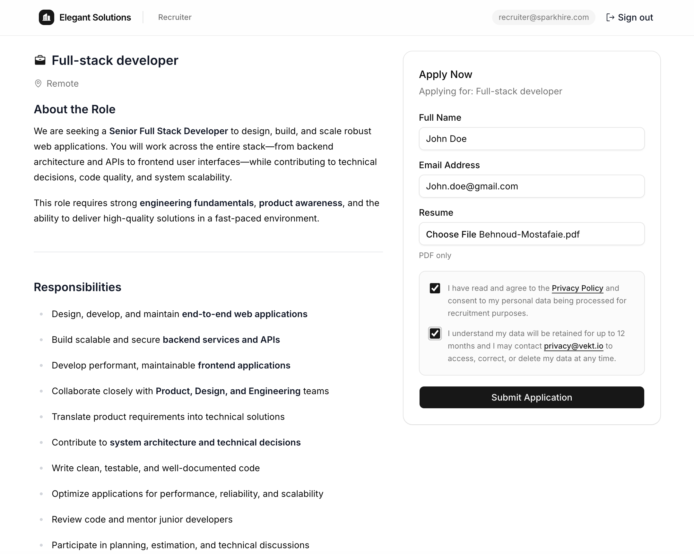
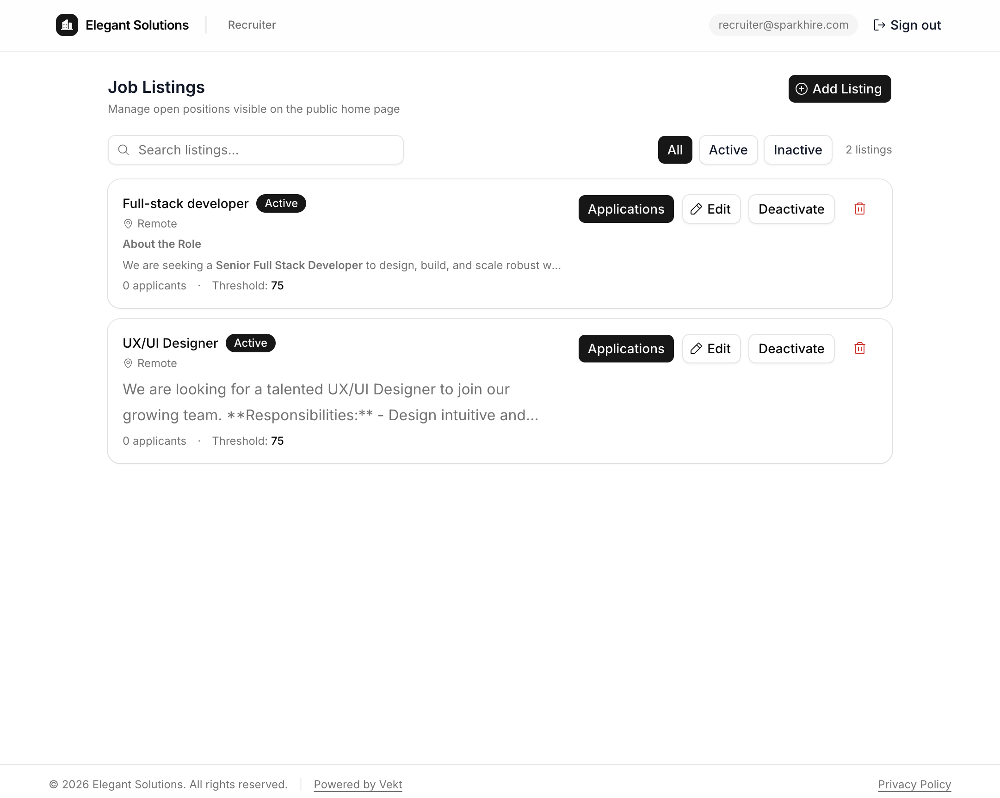
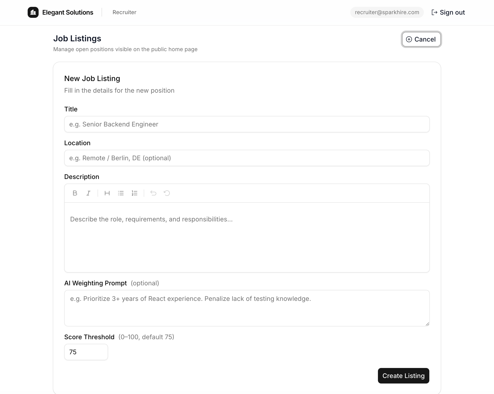
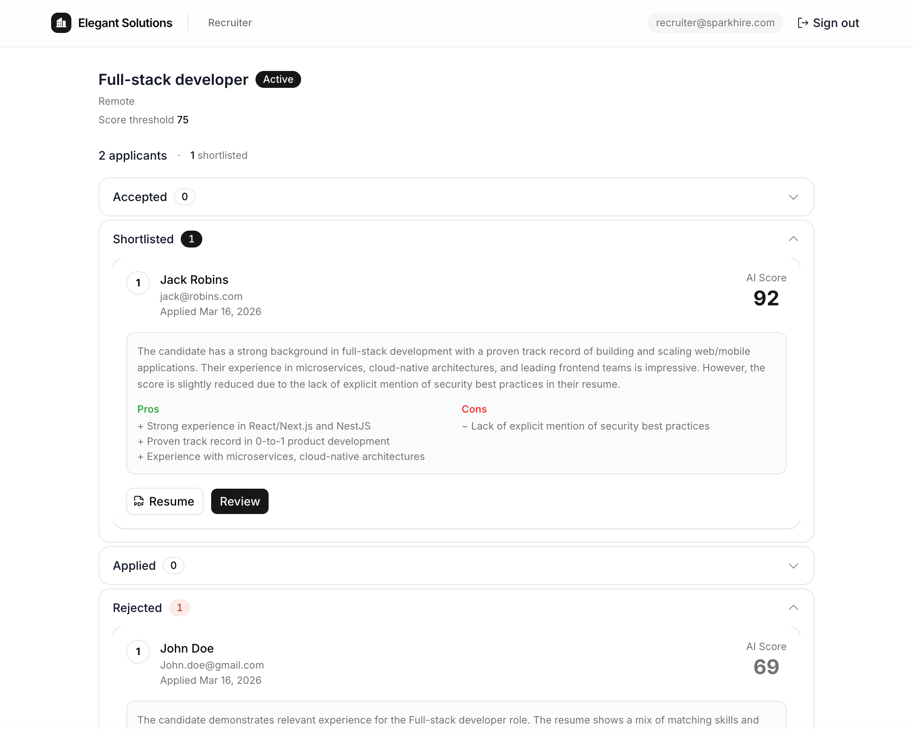

# Vekt — AI-Powered Recruitment Platform

[](https://nextjs.org)
[](https://prisma.io)
[](#docker)
[](LICENSE)
[](LICENSE)
[](https://typescriptlang.org)
[](https://vekt-demo.behnoud.net)

> **[Live Demo →](https://vekt-demo.behnoud.net)**

Vekt is an open source, self-hosted recruitment platform that automates candidate screening using AI.

Recruiters publish jobs, candidates apply with a CV, and a durable pipeline scores and ranks applicants to speed up hiring decisions while keeping humans in control.

Use Vekt if you need:
- Full ownership of applicant data and infrastructure
- A modern ATS-like workflow without SaaS lock-in
- A hackable TypeScript codebase for custom hiring logic

## Why Vekt

- **Self-host first**: run the full stack with Docker (`app` + `inngest`) on your own infrastructure
- **Open source MIT**: fork, extend, and ship your own recruiting workflow
- **Privacy-aware by default**: protected file serving, consent capture, and configurable retention policy
- **Production-ready primitives**: auth, role-based admin/recruiter UX, API docs, background jobs, and observability

---

## Screenshots

### Public jobs home



### Job listing page



### Recruiter dashboard



### Add listing form



### Recruiter applications page



---

## Features

- **AI resume scoring** — pluggable provider: `mock` (default), OpenAI, or local Ollama
- **Durable evaluation pipeline** — powered by [Inngest](https://inngest.com) (self-hostable); falls back to direct in-process execution when Inngest is not configured
- **Structured failure logging** — AI provider/API failures, JSON parsing errors, and pipeline step failures are logged with candidate/step/provider context for faster debugging
- **Screening questions** — per-job `SINGLE` (radio) and `MULTIPLE` (checkbox) questions shown to candidates as a second apply-form step; answers stored and displayed alongside AI reasoning in the recruiter dashboard
- **Delayed status emails** — status-change emails are held for a configurable delay (default 48 h); if a recruiter overrides the decision before the delay elapses the pending email is automatically cancelled and a new one is scheduled
- **Admin-editable email templates** — all candidate email subjects and HTML bodies are stored in the database and editable from the Admin Dashboard; every sent email is logged with its Resend delivery ID
- **Recruiter dashboard** — per-job applications view sorted by AI score; shortlist, accept, or reject candidates with AI reasoning and screening-question answers
- **Admin dashboard** — manage recruiter accounts, configure data retention and status email delay, edit email templates
- **Automated data purge** — Inngest cron job deletes candidate records and resume files that exceed the configured retention window
- **GDPR-compliant** — strictly necessary cookies only, configurable auto-deletion of candidate data, privacy policy included
- **Secure file handling** — resume PDFs stored outside the web root (`private/uploads/`), served only to authenticated users via a protected API route
- **Job slugs** — human-readable URLs for every job listing (e.g. `/jobs/ux-ui-designer`)
- **Swagger UI** — full API documentation at `/api-docs`
- **Docker-ready** — single `docker-compose up` to run the app + Inngest together

---

## How It Works

```
Candidate submits application (name, email, PDF CV)
  └─ Step 1: name, email, PDF resume
  └─ Step 2 (if job has screening questions): answer SINGLE/MULTIPLE choice questions
  └─ PDF stored in private/uploads/ (UUID filename, max 5 MB)
  └─ Answers validated (IDOR-protected: all questionId/optionId must belong to the job)
  └─ DB record created  →  status: APPLIED

Inngest pipeline triggers (or direct fallback in dev)
  └─ PDF text extracted (unpdf)
  └─ AI scores the CV against the job description
  └─ Score ≥ threshold  →  status: SHORTLISTED
     Score < threshold  →  status: REJECTED
  └─ Status email scheduled (delayed by STATUS_EMAIL_DELAY_HOURS, default 48 h)
     Email subject/body loaded from admin-editable EmailTemplate table

Recruiter reviews candidates (per-job applications page)
  └─ Accept / Reject / Shortlist  →  status updated
  └─ Screening-question answers shown alongside AI reasoning
  └─ Pending email cancelled  →  new email scheduled for updated status

Inngest cron (daily at 02:00 UTC)
  └─ Reads RETENTION_DAYS from admin settings
  └─ Deletes candidates + resume files older than the window
```

### Scoring Formula

$$Score_{total} = (Score_{relevance} \times 0.4) + (Score_{experience} \times 0.6)$$

Candidates with $Score_{total} \ge threshold$ (default 75) are marked **Shortlisted**.

---

## Tech Stack

| Concern | Technology |
|---|---|
| Framework | Next.js 15 (App Router) |
| Database | SQLite via **Prisma 7** + `better-sqlite3` |
| Auth | **NextAuth v5** — credentials (email + bcrypt password) |
| AI Pipeline | **Inngest** (durable functions + cron) |
| AI Providers | Mock · OpenAI · Ollama |
| PDF Extraction | **unpdf** |
| Validation | **Zod** |
| Logging | **Pino** (structured JSON; pretty-printed in dev) + step-level AI/pipeline error context |
| UI Components | **shadcn/ui** + Tailwind CSS v4 + Phosphor Icons |
| Rich Text | **Tiptap** |
| API Docs | **Swagger UI** |

---

## Getting Started

### Prerequisites

- Node.js 20+
- pnpm 10+

### 1. Clone & install

```bash
git clone https://github.com/Behnoudmst/vekta.git
cd vekta
pnpm install
```

### 2. Configure environment

```bash
cp .env.example .env
```

Minimum required variables:

```env
DATABASE_URL="file:/absolute/path/to/dev.db"
AUTH_SECRET="your-secret-min-32-chars"

SEED_ADMIN_EMAIL="admin@example.com"
SEED_ADMIN_PASSWORD="change-me-to-a-long-random-password"
```

See [`.env.example`](.env.example) for all options including AI provider and Inngest configuration.

### 3. Run database migrations

```bash
pnpm run db:migrate
```

### 4. Seed the database

Creates the initial **Admin** account, sample job listing, and email templates using the credentials from `.env`.

```bash
pnpm run db:seed
```

### 5. Start the dev server

```bash
pnpm run dev
```

Open [http://localhost:3000](http://localhost:3000).

> Inngest is **not required** in development. When `INNGEST_EVENT_KEY` is blank the evaluation pipeline runs directly in-process. Note: the data-retention cron only runs when Inngest is active.

---

## AI Providers

Set `AI_PROVIDER` in `.env`:

| Value | Description | Required env vars |
|---|---|---|
| `mock` (default) | Random deterministic scores — no external calls | — |
| `openai` | GPT-4o via OpenAI API | `OPENAI_API_KEY` |
| `ollama` | Local model via Ollama | `OLLAMA_BASE_URL`, `OLLAMA_MODEL` |

---

## Inngest

Inngest powers three background jobs:

| Function | Trigger | Description |
|---|---|---|
| `analyze-candidate` | `vekt/candidate.created` event | AI evaluation pipeline |
| `send-delayed-status-email` | `vekt/candidate.status.email.scheduled` event | Sleeps for the configured delay, then sends the status email; cancelled automatically via `vekt/candidate.status.updated` if the status changes before the delay elapses |
| `purge-expired-candidates` | Cron — daily 02:00 UTC | Deletes candidates + resume files past `RETENTION_DAYS` |

### Self-hosted (Docker — recommended)

The included `docker-compose.yml` runs an Inngest container alongside the app. No external account needed.

Before starting Docker, set these required secrets in your shell or `.env` file:

```env
AUTH_SECRET=generate-a-random-32+-char-secret
INNGEST_EVENT_KEY=generate-a-random-event-key
INNGEST_SIGNING_KEY=generate-a-random-hex-signing-key
```

If you want the container to seed the database on first boot, also set:

```env
SEED_ON_START=true
SEED_ADMIN_EMAIL=admin@example.com
SEED_ADMIN_PASSWORD=change-me-to-a-long-random-password
```

```bash
docker-compose up --build
```

### Inngest Cloud (optional)

Sign up at [inngest.com](https://inngest.com), create an app, and set `INNGEST_EVENT_KEY` + `INNGEST_SIGNING_KEY` from the dashboard. Remove `INNGEST_BASE_URL` (or leave it unset) to point the SDK at Inngest Cloud.

### Local dev without Docker

```bash
npx inngest-cli@latest dev
```

The dev server auto-discovers the handler at `http://localhost:3000/api/inngest`.

---

## Docker

```bash
docker-compose up --build
```

The compose file starts two services:

- **`inngest`** — self-hosted Inngest server on port `8288`
- **`app`** — Next.js application on port `3000`

Persistent volumes:
- `db-data` → SQLite database
- `uploads` → Candidate resume PDFs (`private/uploads/`)

---

## Routes

| Route | Access | Description |
|---|---|---|
| `/` | Public | Home page — active job listings |
| `/jobs/[slug]` | Public | Job detail + application form |
| `/status/[id]` | Public | Application status tracker |
| `/privacy` | Public | GDPR privacy policy |
| `/login` | Public | Recruiter / admin login |
| `/recruiter` | Recruiter | Job listings dashboard |
| `/recruiter/jobs/[jobId]` | Recruiter | All applicants for a job, sorted by AI score |
| `/recruiter/all` | Recruiter | All candidates across all jobs |
| `/admin` | Admin | User management + data retention settings |
| `/api-docs` | Public | Swagger UI — full API reference |

---

## API Endpoints

| Method | Route | Auth | Description |
|---|---|---|---|
| `POST` | `/api/candidates` | — | Submit application (multipart/form-data, max 5 MB PDF) |
| `GET` | `/api/candidates` | ✅ | List all candidates |
| `GET` | `/api/uploads/[filename]` | ✅ | Serve a candidate resume PDF |
| `GET` | `/api/job-listings` | — | List all active job listings |
| `POST` | `/api/job-listings` | ✅ | Create a job listing (slug auto-generated) |
| `PATCH` | `/api/job-listings/[id]` | ✅ | Update a job listing |
| `DELETE` | `/api/job-listings/[id]` | ✅ | Delete a job listing |
| `GET` | `/api/recruiter/queue` | ✅ | Shortlisted candidates (score ≥ threshold) |
| `PATCH` | `/api/recruiter/review/[id]` | ✅ | Record ACCEPT / REJECT decision |
| `GET` | `/api/admin/settings` | ✅ Admin | Read global settings (`RETENTION_DAYS`, `STATUS_EMAIL_DELAY_HOURS`) |
| `PUT` | `/api/admin/settings` | ✅ Admin | Update global settings |
| `GET` | `/api/admin/users` | ✅ Admin | List recruiter accounts |
| `POST` | `/api/admin/users` | ✅ Admin | Create recruiter account |
| `DELETE` | `/api/admin/users/[id]` | ✅ Admin | Delete recruiter account |
| `GET` | `/api/admin/email-templates` | ✅ Admin | Fetch all email templates |
| `PUT` | `/api/admin/email-templates/[type]` | ✅ Admin | Update an email template |
| `GET` | `/api/job-listings/[id]/questions` | — | Fetch screening questions for a job |
| `PUT` | `/api/job-listings/[id]/questions` | ✅ | Replace screening questions for a job |
| `GET` | `/api/swagger` | — | OpenAPI 3.0 JSON spec |

---

## Candidate Status Flow

```
APPLIED → ANALYZING → SHORTLISTED → ACCEPTED
                    ↘ REJECTED
```

Status-change emails (`SHORTLISTED`, `REJECTED`, `ACCEPTED`) are queued and delivered after a configurable delay (default **48 hours**). If a recruiter changes the status before the delay elapses, the pending email is cancelled and a new delayed email is scheduled for the updated status. Set `STATUS_EMAIL_DELAY_HOURS` to `0` in the Admin Dashboard to send immediately.

---

## Observability

- AI evaluation logs include provider-level failure context (status code, model, and safely truncated response snippets) for OpenAI and Ollama requests.
- AI response validation logs malformed or non-JSON payloads before surfacing errors.
- Inngest pipeline logs include candidate-aware step failure context (for example: `ai-evaluate`, `save-evaluation`, `schedule-evaluation-email`).
- Direct fallback evaluation mode logs top-level pipeline failures with candidate context.

---

## Scripts

| Command | Description |
|---|---|
| `pnpm run dev` | Start dev server with hot reload |
| `pnpm run build` | Production build |
| `pnpm run db:migrate` | Run Prisma migrations |
| `pnpm run db:seed` | Seed admin + recruiter accounts |
| `pnpm run db:generate` | Regenerate Prisma client after schema changes |

---

## License

MIT — see [LICENSE](LICENSE).

